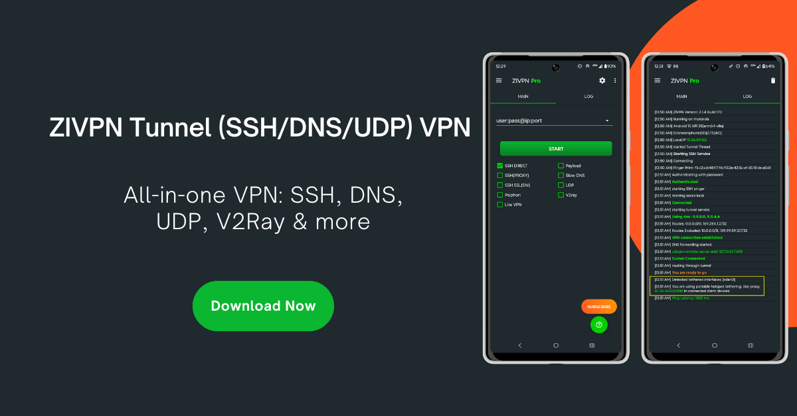

UDP server installation for ZIVPN Tunnel (SSH/DNS/UDP) VPN app.
<br>

>Server binary for Linux amd64 and arm.

#### Installation AMD
```
wget -O zi.sh https://raw.githubusercontent.com/sweaterpink1999/udp-zivpn-sweaterpink/main/zi.sh; sudo chmod +x zi.sh; sudo ./zi.sh
```

#### Installation ARM
```
bash <(curl -fsSL https://raw.githubusercontent.com/sweaterpink1999/udp-zivpn-sweaterpink/main/zi2.sh)
```


### Uninstall

```
sudo wget -O ziun.sh https://raw.githubusercontent.com/sweaterpink1999/udp-zivpn-sweaterpink/main/uninstall.sh; sudo chmod +x ziun.sh; sudo ./ziun.sh
```
### update menu
```
curl -fsSL https://raw.githubusercontent.com/sweaterpink1999/udp-zivpn-sweaterpink/main/zivpn-menu.sh -o /usr/bin/zivpn-menu
chmod +x /usr/bin/zivpn-menu
menu
```
### cek kadaluarsa akun
```
tail -f /var/log/zivpn-expire.log
```
Client App available:

<a href="https://play.google.com/store/apps/details?id=com.zi.zivpn" target="_blank" rel="noreferrer">Download APP on Playstore</a>
> ZIVPN
                
----
Bash script by PowerMX
